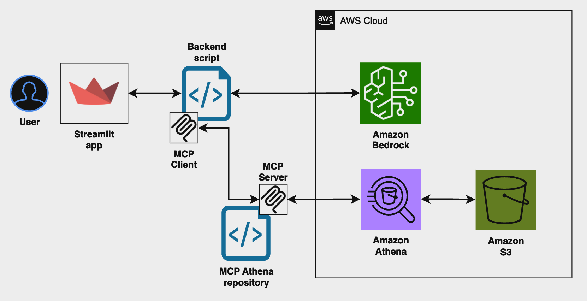

# Agentic AI Data Transform

A reference architecture and code sample for building intelligent data transformation pipelines using natural language instructions with Amazon Bedrock, Amazon Athena, and MCP (Model-Context-Protocol).



## Overview

This repository demonstrates how to build an ETL (Extract, Transform, Load) system that allows users to transform structured data using natural language instructions. For example, a user can input commands like "Normalize all numerical values in this dataset" and the system will automatically generate and execute the appropriate Athena SQL queries.

The solution leverages:
- **Amazon Bedrock (Anthropic Claude)** for natural language understanding and orchestration
- **Model-Context-Protocol (MCP)** server to interface between the AI agent and data processing engines
- **Amazon Athena** for scalable SQL-based data processing
- **Amazon S3** for data storage
- **Streamlit** for an interactive, modern user interface

## Key Features

- 🗣️ **Natural Language Interface**: Transform your data using everyday language
- 🤖 **AI-Powered Orchestration**: Anthropic Claude plans and executes complex data transformations
- ⚡ **Scalable Processing**: Leverage Amazon Athena for processing large datasets
- 🔄 **Dynamic Adaptation**: System adjusts to different datasets and transformation needs
- 💻 **Modern UI**: Professional, attractive Streamlit app for file upload, chat, and results
- 🔌 **Modular Architecture**: Easily swap components or extend functionality

## Streamlit App: ETL Data Transformation Agent

The included Streamlit app provides a user-friendly interface for uploading data and interacting with the ETL agent.

### How it works

1. **Upload a CSV, JSON, or Excel file** using the sidebar.
2. **Chat with the ETL Agent**: Ask for data transformations, schema info, or previews in plain English.
3. The agent uses **Amazon Bedrock (Anthropic Claude)** to generate and execute **Athena SQL** on your data.
4. See instant previews, schema, and transformation results—all in one place.

### Example requests

- "Show me the available columns and their types."
- "Filter rows where amount > 1000 and group by category."
- "Add a new column with the sum of columns A and B."

### Features

- **File upload**: Supports CSV, JSON, and Excel files
- **Chat interface**: Natural language requests for data transformation
- **Live previews**: See schema, sample rows, and transformation results
- **Professional AWS look and feel**: Modern, branded UI
- **Clear chat/reset**: Easily start over with new data

## Getting Started

### Prerequisites

- AWS Account with access to Amazon Bedrock, Athena, and S3
- Python 3.8+
- AWS CLI configured

### Installation

```bash
# Clone the repository
git clone https://github.com/aws-samples/agentic-ai-data-transform.git
cd agentic-ai-data-transform

# Install Python dependencies
pip install -r requirements.txt

# (Optional) Set up AWS resources as described in the architecture
```

### Configuration

- Edit `config.json` to set your S3 bucket and other parameters
- Ensure your AWS credentials are configured for Amazon Bedrock and Athena access

## Usage

1. Run the Streamlit app:

```bash
streamlit run function_calling/streamlit_app.py
```

2. In your browser:
   - Upload a data file (CSV, JSON, Excel)
   - Enter a natural language request in the chat (e.g., "Show me the available columns")
   - View schema, preview, and transformation results instantly

## Architecture Details

### Components

1. **Streamlit UI**: Accepts file uploads and natural language instructions from users
2. **Amazon Bedrock (Anthropic Claude)**: 
   - Parses natural language instructions
   - Plans transformation steps
   - Generates Athena SQL queries
   - Orchestrates the entire process
3. **MCP Server**: 
   - Provides standardized interface between AI and data systems
   - Routes queries to the appropriate processing engine
4. **Amazon Athena**: Executes data transformations at scale
5. **S3 Storage**: Stores raw and processed data

### Workflow

1. User uploads a file and submits a natural language instruction
2. Amazon Bedrock (Anthropic Claude) interprets the request
3. Agent generates appropriate Athena SQL queries
4. Queries are sent to the MCP Server
5. MCP Server routes queries to Athena
6. Results are displayed in the Streamlit app

## Customization

### Adding New Transformation Types

1. Add new examples to the `examples/transformations/` directory
2. Update the prompt templates in `prompts/transformation_templates.json`
3. If needed, add new SQL templates in `config/sql_templates.json`

### Supporting New Data Sources

1. Add connector configuration in `config/data_sources.json`
2. Implement the connector interface in `src/connectors/`
3. Update the agent configuration to recognize the new data source

## Contributing

Contributions are welcome! Please see [CONTRIBUTING.md](CONTRIBUTING.md) for details.

## Security

See [SECURITY.md](SECURITY.md) for details on our security policy and how to report security issues.

## License

This library is licensed under the MIT-0 License. See the [LICENSE](LICENSE) file.
